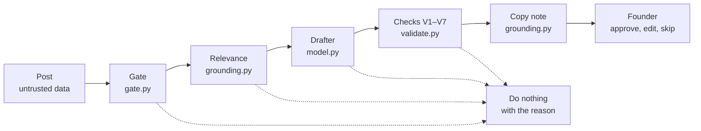

# DraftVoice

<p align="center">
  
  
  
  <a href="docs/eval-report.md"></a>
</p>

Founder-controlled comment review for LinkedIn. Built for the Byro technical challenge: help a founder decide when a LinkedIn conversation is worth joining, and propose a useful comment in their voice, while the founder keeps control of every external action.

**The model proposes, the application validates, the founder decides.** When a post is irrelevant, or no approved evidence supports a contribution, DraftVoice does nothing. It never posts.

## Quick Start

```bash
./setup.sh
.venv/bin/draftvoice propose --founder rico --text "Does your LinkedIn profile matter before an investor meeting?"
```

`setup.sh` needs Python 3.11+. It creates `.venv`, installs DraftVoice, and runs the tests. No API key or network access is needed.

DraftVoice either drafts a comment, with the evidence behind each sentence and the result of every check, or says why it does nothing. The founder is `rico` or `fathin` (`alex` is synthetic test data).

For live drafts, put `GEMINI_API_KEY` in `.env` (see `.env.example`). When a key is set, the browser panel and the API use Gemini by default. Without one, they use an offline stub.

## How It Works



| Stage | What it decides |
| --- | --- |
| Gate | Code decides whether to engage: sensitive, engagement bait, milestone, founder topics, then approved evidence. The model never decides. |
| Relevance | The evidence must share at least one non-generic word with the post. Sharing only words like "agent" or "built" is not enough. Otherwise it stops with "No evidence relates to this post". |
| Drafter | Gemini writes a new comment in the founder's voice that answers the post, using evidence only as facts. It may decline. The offline stub quotes the evidence on purpose, to test the checks. |
| Checks | Every sentence is re-checked against the evidence it cites. Failing any of V1–V7 blocks the draft. |
| Copy note | A sentence that reuses more than 60% of its evidence's wording gets "Reuses your earlier wording" and does not count toward V5. It never blocks; the founder decides. |
| Milestones | Funding, launch, and win posts get one of the founder's own past reactions ("congrats!"). No model is used. |

| Check | Blocks |
| --- | --- |
| V1 evidence | A sentence with no citation, or one citing evidence that is not approved for this post |
| V2 numbers | A number not in the cited evidence or the post |
| V3 names | A name, link, or handle not in the cited evidence or the post |
| V4 first person | A "we built" or "our" claim its evidence does not back |
| V5 generic | Stock phrases ("great post") or nothing specific to the post |
| V6 repeats | A draft too close to the founder's recent comments |
| V7 format | Invalid output, or more than 600 characters |
| voice rules | Never blocks: length, case, and emoji notes only |

## Usage

| Command | Purpose |
| --- | --- |
| `draftvoice propose --founder rico --text "..."` | Draft a comment for pasted text, or do nothing |
| `draftvoice propose --founder rico --post p-agents` | Use a synthetic post from `fixtures/posts.json` |
| `draftvoice propose ... --drafter gemini` | Write a live draft (the CLI default is `MODEL_MODE` in `.env`, else `stub`) |
| `draftvoice propose ... --drafter dishonest-number` | A stub that lies on purpose (also `-name`, `-first_person`, `-unknown_evidence`, `-bad_json`) |
| `draftvoice review pr-1a2b3c4d --accept` | Review a draft: `--accept`, `--edit "..."`, `--reject`, `--skip` |
| `draftvoice rules` | List suggested voice rules (one appears after the same edit twice) |
| `draftvoice rules approve rule-0f44ae` | Approve a rule; creates a new profile version |
| `draftvoice rules revert --founder rico` | Go back to the previous profile version |
| `draftvoice serve` | Mock feed and review panel at http://127.0.0.1:8765 |
| `draftvoice eval` | Write [`docs/eval-report.md`](docs/eval-report.md); `--live` also judges Gemini drafts |

Reviews, rule suggestions, and profile versions are saved in `.draftvoice/`, which is not committed.

### Browser

`draftvoice serve` shows a mock feed of synthetic posts, plus a few real public posts by Rico and Fathin (each tagged). Click the **DraftVoice** tab on the right edge to open a sidebar. It reads the post most visible on screen, shows each step of the decision, then shows the draft with its evidence. You can switch between Rico and Fathin, edit, and approve. Approving copies the comment. "Not this post?" lets you pick a different one. The server only listens on this machine and refuses requests from other websites.

### On LinkedIn (Chrome)

1. Run `.venv/bin/draftvoice serve` and leave it running.
2. Open `chrome://extensions`, turn on **Developer mode**, click **Load unpacked**, and choose the `extension/` folder.
3. On LinkedIn, scroll to a post and click the blue **DraftVoice** tab on the right edge.

**Choose post by** in the sidebar footer sets how the post is picked:

| Option | How the post is picked |
| --- | --- |
| D | The post on a single post page (open one by clicking its timestamp) |
| C | Text you highlighted before clicking the tab |
| A | The post most visible on screen |
| B | The post you click (posts get a dashed outline on hover) |

**Auto** tries D, C, and A in turn, then falls back to B. When you scroll to another post with the sidebar open, a **Draft this post** button appears on it. Click it, or **↻** in the sidebar, to switch. Nothing is read until you click.

The extension reads only the one post you choose (author, headline, and text, or just your highlight), and only after you click. It never scrolls, reads the feed in the background, stores anything from LinkedIn, types into LinkedIn, or posts. It can reach only linkedin.com and this machine's DraftVoice server. Fathin gave written permission for this scope on 2 Oct 2026 (see the [decision log](docs/decision-log.md)).

## Project Structure

```text
byro-draftvoice/
|-- src/draftvoice/
|   |-- gate.py            # Engage decision (frozen for the eval)
|   |-- validate.py        # Checks V1–V7 and voice notes (frozen for the eval)
|   |-- grounding.py       # Relevance and copy checks around them
|   |-- pipeline.py        # Post -> gate -> draft -> checks -> proposal
|   |-- model.py           # Gemini adapter, honest and dishonest stubs, prompt
|   |-- learning.py        # Reviews, suggested rules, profile versions
|   |-- api.py             # Local API (127.0.0.1 only)
|   |-- cli.py             # draftvoice command
|   |-- eval.py            # Writes docs/eval-report.md
|   `-- web/               # Mock feed
|-- extension/             # Chrome extension and the shared review panel
|-- data/founders/         # Rico's and Fathin's real profiles and evidence
|-- fixtures/              # Synthetic posts, founder alex, unseen lies
|-- docs/                  # Design, decision log, evidence, eval report, time log
|-- tests/                 # Pytest suite
`-- setup.sh               # Create venv, install, run tests
```

## Configuration

`.env` in the repository root (real environment variables win):

| Variable | Purpose |
| --- | --- |
| `GEMINI_API_KEY` | Turns on live drafts; the panel and the API then use Gemini by default |
| `MODEL_MODE` | `stub` or `gemini`; overrides that default |
| `GEMINI_MODEL` | Defaults to `gemini-3.5-flash` |

## Results

From [`docs/eval-report.md`](docs/eval-report.md). The checks were frozen before measuring and not tuned afterwards.

| What was measured | Result |
| --- | --- |
| Unseen lies blocked | 14/20 (70%) |
| Founders' real contributions that pass | 4/10 (40%) |
| Gate matches what the founders did | 28/38 (74%) |
| On-topic posts that get a draft | 12/13 (92%) |
| Near-duplicate drafts caught | 36/44 (82%) |

The samples are small, so read these as directional. The report lists known gaps.

## Documentation

- [Design (v1, before user research)](docs/design.md)
- [Decision log: assumptions, alternatives, AI use](docs/decision-log.md)
- [Evidence: labelled comments and posts](docs/evidence.md)
- [Eval report](docs/eval-report.md)
- [Time log: active time by phase](docs/time-log.md)

## Status

Proof in progress. Next: design-partner sessions, then a thin runnable proof that tests the riskiest assumption.

## Boundaries

- No LinkedIn login, scraping, commenting, or posting. Input is synthetic fixtures or text the user confirmed, and output ends at a copy or mock handoff.
- All test data is synthetic and labelled as such.
- No API keys are committed. The default demo and the tests run without model credentials.
