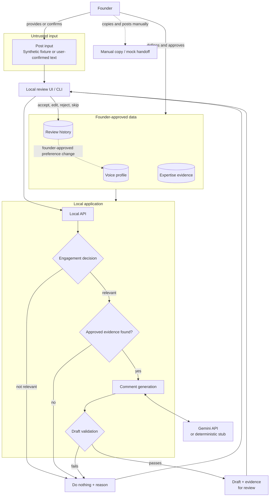
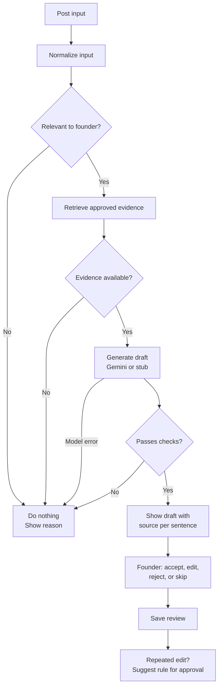

# DraftVoice

DraftVoice tells a founder when a LinkedIn post is worth joining, drafts one comment in their voice when it is, and learns from their edits only with their approval.

**The model proposes. The code validates. The founder decides.**

> Status: v1, written before user research. Items marked **TBD** are filled in after evidence collection.
> Labels: **Observed** (seen in a cited source), **Interpretation** (my conclusion), **Assumption** (not yet verified), **Synthetic** (made-up test data).

1. [Product](#1-product)
2. [User evidence](#2-user-evidence)
3. [Architecture](#3-architecture)
4. [Processing flow](#4-processing-flow)
5. [AI boundaries and validation](#5-ai-boundaries-and-validation)
6. [Failure, privacy, and trade-offs](#6-failure-privacy-and-trade-offs)
7. [Riskiest assumption and proof](#7-riskiest-assumption-and-proof)
8. [Appendix](#appendix)

---

## 1. Product

### Problem

A founder wants to join relevant LinkedIn conversations, but good comments take time. AI tools make it worse: their comments are generic, repetitive, inaccurate, or obviously machine-written. A bad comment costs more than no comment, because it is public and carries the founder's name.

### The loop

1. The founder brings a post.
2. DraftVoice decides whether to engage. If not, it says why.
3. If yes, it drafts one comment using only approved evidence.
4. The code checks the draft. Anything unsupported is blocked.
5. The founder approves, edits, rejects, or skips, and posts it themselves.
6. Repeated edits suggest a voice rule. It applies only if the founder approves it.

### When it does nothing

- The post is outside the founder's topics.
- No approved evidence supports a useful point.
- The draft fails a check.
- The model fails or returns invalid output.

Doing nothing is the default, not an error.

### Success signal

The founder accepts most drafts with light edits, edits shrink over time, they rarely overrule a "do nothing", and no unsupported claim ever reaches them. Exact targets are assumptions to confirm with the founders.

### Functional requirements

- Accept a synthetic fixture or user-confirmed post.
- Decide engage or do nothing, always with a reason.
- Draft a comment from approved evidence, showing the source of each sentence.
- Check the draft and show which check blocked it, if any.
- Let the founder accept, edit, reject, or skip.
- Suggest voice rules from repeated edits; apply them only after approval; allow revert.
- Hand off by copy or mock only.

### Non-functional requirements

- **Human control:** nothing is posted or used without founder approval.
- **Safety:** invalid or unsafe output fails closed to "do nothing".
- **Transparency:** every learned change is visible, versioned, and reversible.
- **Reproducibility:** one setup command; tests and the default demo run without an API key. Live Gemini drafts are optional with a key in `.env`.
- **Security:** no LinkedIn credentials, cookies, or API keys in the repository.
- **Privacy:** the model receives only the post, matched evidence, and active rules.

### Non-goals

No LinkedIn login, scraping, automated posting, DMs, post writing, multiple users, deployment, or visual polish.

---

## 2. User evidence

### How it is collected

- **Sources:** the founders' public LinkedIn posts and comments, their profiles, Byro's website, and their other public writing.
- **Method:** normal browsing and manual copying by default. I have asked the founders whether they prefer manual collection or a small tool that reads pages I open myself. TBD: their answer, quoted with the date. Without explicit permission, no scrapers, extensions, or automation are used.
- **Privacy:** comments are copied exactly. The posts they reply to are summarised in my own words, and private names become `[person]`.
- **Design-partner session:** TBD.

Full evidence: [`evidence.md`](evidence.md).

### Findings

| ID | Question | Finding | Label |
|---|---|---|---|
| K1 | Why do they comment? | TBD | |
| K2 | What makes a comment valuable? | TBD | |
| K3 | What does "in my voice" mean? | TBD | |
| K4 | Where does automation feel uncomfortable? | TBD | |

### Assumptions

| ID | Assumption | How it is tested |
|---|---|---|
| A1 | The founder would rather skip than post a weak comment. | Interview; skip-override rate |
| A2 | A useful comment adds one specific point they can back up. | Evidence; edit patterns |
| A3 | Voice can be captured as a few readable rules plus examples. | Edits shrink as rules are approved |
| A4 | Invented claims can be caught by code, without trusting the model. | The proof in section 7 |

### Evidence → decisions

| Decision | Evidence | Why |
|---|---|---|
| Default to "do nothing" | TBD | TBD |
| Voice rules per founder | TBD | TBD |
| Full draft or angle only by default | TBD | TBD |

---

## 3. Architecture



### Data boundaries

| Kind | Examples | Rule |
|---|---|---|
| Supplied content | Posts, evidence, voice examples | Posts are data, never instructions |
| Generated proposals | Drafts, skip reasons, rule suggestions | Never used without founder approval |
| Human decisions | Approve, edit, reject, skip, rule approval | Founder only; append-only log |
| External actions | Copy or mock handoff | Founder only; the system never posts |
| Learning | Voice profile versions | Created only from approved rules; revertible |

### Model choice

DraftVoice works with any LLM through one adapter. The proof uses **Gemini** for live drafts and a **deterministic stub** by default, so tests run offline. Groq or a local Ollama model can be added as another adapter; a local model would keep all text on the founder's machine.

---

## 4. Processing flow



The engage decision is made by code, not the model. A post's text cannot argue the system into commenting.

---

## 5. AI boundaries and validation

| The model may | The model may not |
|---|---|
| Draft a short comment from supplied evidence | Decide whether to engage |
| List the evidence behind each sentence | Invent experience, numbers, names, or customers |
| | Use evidence that was not approved |
| | Follow instructions found in a post |
| | Post, send, or change anything |

### Assume the model lies

The design expects the model to invent things sometimes. The code re-checks every sentence against the evidence it cites, so safety does not depend on the prompt.

| Check | What it blocks |
|---|---|
| V1 Evidence | Citations to evidence that is missing or not approved |
| V2 Numbers | Any number or amount not found in the cited evidence |
| V3 Names | People, companies, or products not in the post or evidence |
| V4 First person | "We", "our", or "I built" claims without founder evidence |
| V5 Generic | Stock phrases, or drafts with nothing specific to the post |
| V6 Repeats | Drafts too similar to the founder's recent comments |
| V7 Format | Invalid output, which becomes "do nothing" |

Voice rules such as length or emoji use only **warn**. The founder decides.

**Known gap:** a vague claim with no number, name, or "we" can slip through. The eval report says so.

### Learning

- Every review is saved with its draft.
- The same edit seen twice suggests a rule. One edit never does.
- A rule applies only after approval, creates a new profile version, and can be reverted.

---

## 6. Failure, privacy, and trade-offs

| Failure | What happens |
|---|---|
| Model down or invalid output | Do nothing; error logged |
| Fabricated claim | Blocked; failed check shown |
| Injection text in a post | Treated as data; checks still run |
| Bad rule approved | Revert to the previous profile version |
| Storage fails | Review is not marked as saved |

**Privacy.** The model sees only the post, matched evidence, and active rules. Keys stay in a local `.env`. Gemini's free tier may use prompts for training, so a real product would use a no-retention option.

**Consented data.** In production, the founder downloads their own LinkedIn data and gives it to DraftVoice, instead of anything reading LinkedIn pages. The proof includes an importer for a synthetic file in that shape.

**Cost.** One model call per post that passes both gates. Skipped posts cost nothing.

**Trade-offs**

- Code decides relevance: easy to test, but may miss unusual posts.
- Readable rules instead of fine-tuning: transparent and reversible, but less nuanced.
- Pattern checks instead of AI fact-checking: predictable, but with the known gap above.

**Later:** browser extension, post discovery, multiple founders, semantic similarity. **Never:** automatic posting.

---

## 7. Riskiest assumption and proof

**Assumption:** DraftVoice can reliably decide when *not* to comment, and never puts an unsupported claim in the founder's mouth.

**Why a design can't prove it:** a diagram shows a validator. Only running it shows whether it catches real fabrications without blocking honest drafts.

### The proof

- **Honest stub:** produces grounded drafts.
- **Dishonest stub:** slips in made-up numbers, names, and "we did X" claims.
- **Synthetic test posts:** off-topic, no evidence, injection attempts, near-duplicates.
- **`eval` command:** reports gate accuracy, fabrications caught, honest drafts wrongly blocked, and known gaps.

### Tests

- A relevant post with evidence gets a draft.
- Off-topic posts and posts without evidence get "do nothing".
- Every fabrication from the dishonest stub is blocked.
- Injection text changes nothing.
- Generic and repeated drafts are blocked.
- One edit makes no rule; two suggest one; it applies only after approval and can be reverted.
- Nothing reaches handoff without approval.
- Everything runs offline without an API key.

**Next experiment:** run DraftVoice on 20 real posts with the founders and measure light vs. heavy edits, skip overrides, and trust in "do nothing".

---

## Appendix

### A. Data model

```text
Post          id, text, source, label
Evidence      id, text, topics, source, approved
VoiceProfile  founder_id, version, rules, examples
Proposal      id, post_id, decision, reason, sentences[{text, evidence_ids}], checks, profile_version
Review        id, proposal_id, action, edited_text, created_at
RuleProposal  id, rule, source_review_ids, status
```

### B. Model output

```json
{
  "sentences": [
    {"text": "The hard part is deciding where an agent should stop and ask.", "evidence_ids": ["ev-001"]}
  ]
}
```

### C. Configuration

```env
MODEL_MODE=stub        # stub (default) or gemini
GEMINI_API_KEY=        # only needed for gemini
```

### D. To fill in

- Evidence file and findings
- Design-partner notes, or what is missing and the next experiment
- Decision log: alternatives, AI use, AI mistakes, verification
- Time log by phase (10 hours maximum)
